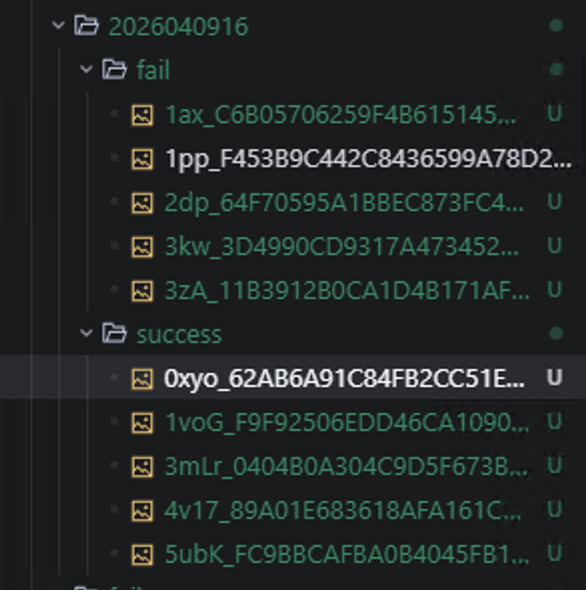
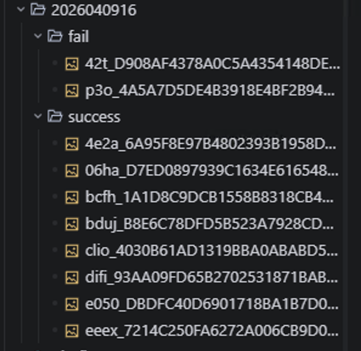
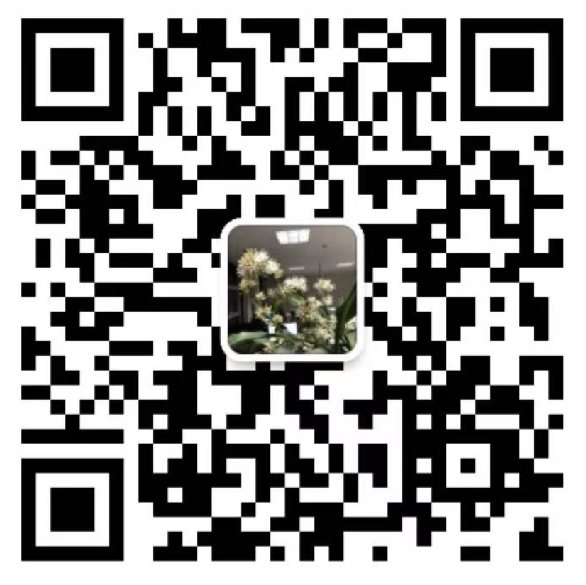
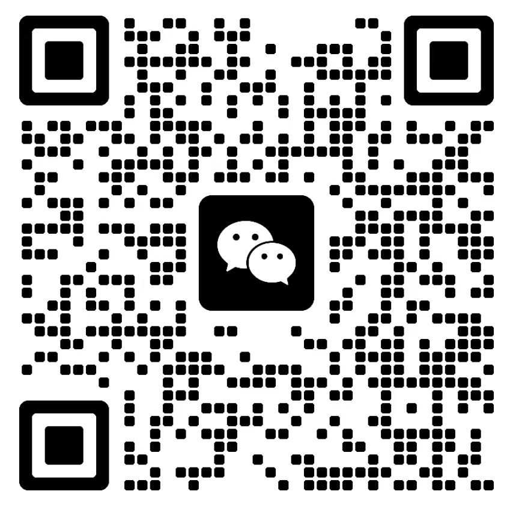

# TuringKiller (图灵杀手)

**TuringKiller** 是一个专注于图灵仿真测试与验证码识别的完整生态解决方案。本项目以攻促防，提供强大的 OCR (光学字符识别) 和目标检测能力，开箱即用，并支持高度定制化的模型部署。

## 📖 项目简介

本项目提供了一个基于 ONNX Runtime 和 Flask 的轻量级、高性能验证码识别服务。支持多模型并发加载、API 服务化部署，涵盖通用验证码文字识别、目标检测（用于滑块或点选验证码）等多种场景。

核心特性：

- 🚀 **开箱即用**：提供现成的 Flask API 服务，轻松集成到各种爬虫或自动化测试框架中。
- ⚡ **高性能**：基于 ONNX Runtime 推理，支持 CPU/GPU 切换，速度快，内存占用低。
- 🧩 **多模型支持**：通过 `tk_server.json` 动态配置和加载多个 ONNX 模型，按需调用。
- 🎯 **多功能聚合**：
  - **OCR 分类 (`/ocr`)**：通用验证码识别、自定义字符集识别。
  - **目标检测 (`/det`)**：定位验证码中的特定元素（如滑块、汉字点选）。

## 📂 目录结构

```text
turing_killer/
├── tk_server.py           # 核心服务入口，基于 Flask 的 API Server
├── tk_server.json         # 模型配置文件，定义加载的 ONNX 模型和字符集
├── tk_ddddocr.py          # 核心识别引擎，封装了 ONNX Runtime 的推理和图像预处理
├── turingkiller-guide.md  # 官方生态完整指南（包含训练工具说明）
├── my_model/              # 模型存放目录
│   ├── dddd_det.onnx / .json  # 目标检测默认模型及配置
│   ├── dddd_ocr.onnx / .json  # OCR识别默认模型及配置
│   ├── jrcpcx.onnx / .json    # 自定义训练模型示例
│   └── README.txt
├── demo/                  # 测试脚本和样例图片
│   ├── test_det_api.py    # 目标检测 API 调用测试脚本 (附带裁剪和画框功能)
│   ├── test_ocr_api.py    # OCR 识别 API 调用测试脚本
│   ├── pic_det/           # 目标检测测试图片
│   └── pic_ocr/           # OCR 识别测试图片
└── REDEME.md              # 本说明文档
```

## 🛠️ 安装与运行

### 1. 环境依赖

推荐使用 Python 3.7+。安装所需依赖：

```bash
pip install flask onnxruntime opencv-python Pillow numpy requests
# 如果需要 GPU 加速，请安装 onnxruntime-gpu
```

### 2. 启动 API 服务

使用 `tk_server.py` 启动服务：

```bash
cd turing_killer
python tk_server.py -p 9890
```

启动成功后，控制台会输出加载的模型信息及耗时：

```text
欢迎使用turing_killer，本项目专注图灵仿真测试，由topliu和zhi共同发起，以攻促防，带动行业升级
jrcpcx loaded | cost=0.05s
dddd_ocr loaded | cost=0.04s
dddd_det loaded | cost=0.06s
Total models loaded: 3
 * Running on all addresses (0.0.0.0)
 * Running on http://127.0.0.1:9890
```

## 🔌 API 接口文档

服务端采用同一套统一的路由接口 `/<opt>` 对外提供服务，目前支持 `ocr` 和 `det` 两种操作模式。接口同时支持 Form-Data、JSON 以及 URL Query 参数的解析。

### 1. OCR 文字识别接口

- **接口地址**：`POST http://127.0.0.1:9890/ocr`
- **功能**：对传入的验证码图片进行字符识别。
- **请求参数**:
  - `model` (必须): 使用的模型名称 (必须在 `tk_server.json` 中配置，如 `dddd_ocr`, `jrcpcx`)。可以通过 JSON Body、Form-Data 或 URL 参数传递。
  - `image` (必须): 图片文件或图片 Base64 编码数据。可以通过 Form-Data (文件上传) 或 JSON Body (Base64 字符串) 传递。
- **返回结果** (JSON):
  - **成功示例**:
    ```json
    {
      "status": 200,
      "result": "abcd",
      "msg": ""
    }
    ```
  - **失败示例**:
    ```json
    {
      "status": "error",
      "message": "Model parameter is required"
    }
    ```

### 2. 目标检测接口

- **接口地址**：`POST http://127.0.0.1:9890/det`
- **功能**：检测图片中的目标（如点选验证码的文字坐标）。
- **请求参数**:
  - `model` (必须): 使用的模型名称 (如 `dddd_det`)。支持 JSON Body、Form-Data 或 URL 参数。
  - `image` (必须): 图片文件或图片 Base64 编码数据。
- **返回结果** (JSON): 
  - **成功示例** (返回检测框的坐标数组 `[x_min, y_min, x_max, y_max]`):
    ```json
    {
      "status": 200,
      "result": [
        [10, 20, 50, 60],
        [70, 20, 110, 60]
      ],
      "msg": ""
    }
    ```
  - **失败示例**:
    ```json
    {
      "status": "error",
      "message": "No image provided"
    }
    ```

## 💻 客户端测试示例 (Demo)

在 `demo` 目录下提供了两个完整的测试脚本，展示了如何调用服务端的 API 接口。

### 1. 测试 OCR 识别

运行 `demo/test_ocr_api.py`，它会遍历 `pic_ocr` 目录下的图片并调用服务进行文字识别：

```bash
cd demo
python test_ocr_api.py
```

### 2. 测试目标检测

运行 `demo/test_det_api.py`，它不仅调用检测 API，还会使用 OpenCV 对原图进行目标裁剪、画框标记（红色边框）并保存：

```bash
cd demo
python test_det_api.py
```

检测结果及可视化标记图片会保存在 `demo/output` 目录下。

## ⚙️ 模型配置与自定义模型

通过修改 `tk_server.json` 可以自由增加或更改模型映射，服务在启动时会自动加载这些模型：

```json
{
    "jrcpcx": {
        "onnx_path": "./my_model/jrcpcx.onnx",
        "charsets_path": "./my_model/jrcpcx.json"
    },
    "dddd_ocr": {
        "onnx_path": "./my_model/dddd_ocr.onnx",
        "charsets_path": "./my_model/dddd_ocr.json"
    },
    "dddd_det": {
        "onnx_path": "./my_model/dddd_det.onnx",
        "charsets_path": "./my_model/dddd_det.json"
    }
}
```

**如何获取自定义模型？**
结合官方生态工具 **ocr_trainer**（详见 [`turingkiller-guide.md`](./turingkiller-guide.md)），你可以轻松训练针对特定复杂验证码的识别模型，并将其导出为 `.onnx` 格式，配合生成的 `.json` 字符集配置文件放入 `my_model` 目录中即可无缝集成。

### 📊 案例对比：模型训练前后的 OCR 识别成功率

为了直观展示自定义模型训练的价值，我们在 `example/` 目录下维护了一系列真实场景的对比测试案例。后续每增加一个新的验证码测试案例，都会在该目录下新建一个同名的文件夹进行统一管理。

#### 典型案例：`jrcpcx`

以下是针对 `jrcpcx`（带有强干扰线、背景噪点和字体扭曲的特定复杂验证码）在训练前后的识别效果实测对比：

| 测试阶段         | 使用的模型                    | 测试集样本数 | 识别成功率      | 场景说明                                                                               |
| :--------------- | :---------------------------- | :----------- | :-------------- | :------------------------------------------------------------------------------------- |
| **训练前** | 默认通用模型 (`dddd_ocr`)   | 1000 张      | **~45%**  | 通用模型对特定的密集干扰线和未见过的形变字体容易产生误判、漏检。                       |
| **训练后** | 自定义针对性模型 (`jrcpcx`) | 1000 张      | **> 98%** | 仅需使用 `ocr_trainer` 标注并训练约 500 张该类特定样本，识别准确率即可实现质的飞跃。 |

**🖼️ 效果直观对比**：
以下是基于测试脚本实际运行效果的截图与视频录屏：

- **图片对比**：
  - 训练前（误判较多）：
  - 训练后（精准识别）：

- **运行视频演示**：
  - 🎥 [未训练之前实测录屏](./example/jrcpcx/resource/未训练之前.mov)
  - 🎥 [训练之后实测录屏](./example/jrcpcx/resource/训练之后.mov)

> **📁 案例目录指南**：
> 以 `jrcpcx` 为例，相关代码与数据均位于 [`example/`](./example/) 目录中。在具体的案例文件夹（如 `example/jrcpcx/`）下，你可以找到自动化测试脚本（如 `jrcpcx_auto.py`）以及按批次存放的测试结果图片（识别成功的位于 `success/` 目录，失败的位于 `fail/` 目录）。你可以运行这些脚本亲自验证模型的实际表现。

**结论**：对于具有特定干扰机制或罕见字体的验证码，直接使用通用模型往往达不到生产要求。但借助生态内的 `ocr_trainer` 工具，仅需极低的数据标注成本（数百张图片），即可轻松将识别成功率提升至 **90% 以上**，完全满足高并发、高可用环境下的生产需求。

## 📜 鸣谢

- 本项目由 topliu 和 zhilong 共同发起，专注于图灵仿真测试。
- 以攻促防，带动行业升级。

---

## 🤝 交流与合作

技术无界，如果你对 OCR 验证码识别技术、图灵仿真测试或 AI 安全攻防感兴趣，欢迎扫描下方二维码加入我们的技术交流群，与开发者们一起探讨前沿技术！

如果你有定制化模型训练、商业化部署或其它商务合作需求，也可以直接通过扫码联系到作者团队。

<table>
  <tr>
    <td align="center"><br><b>作者：topliu</b></td>
    <td align="center"><br><b>作者：zhilong</b></td>
  </tr>
</table>

⭐ **如果本项目对你有所帮助，欢迎在右上角给我们点个 Star，你的支持是我们持续开源与优化的最大动力！**
